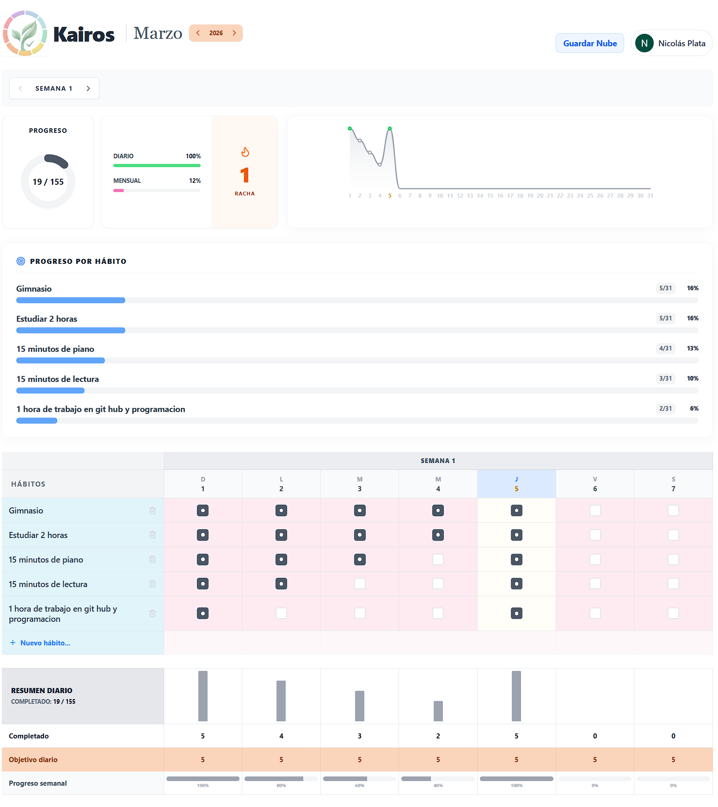
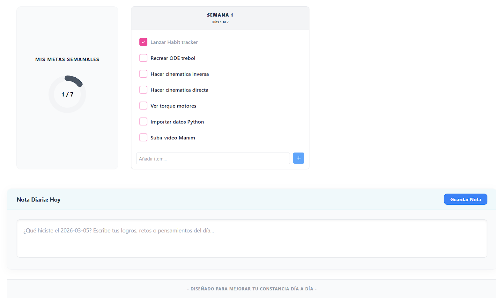
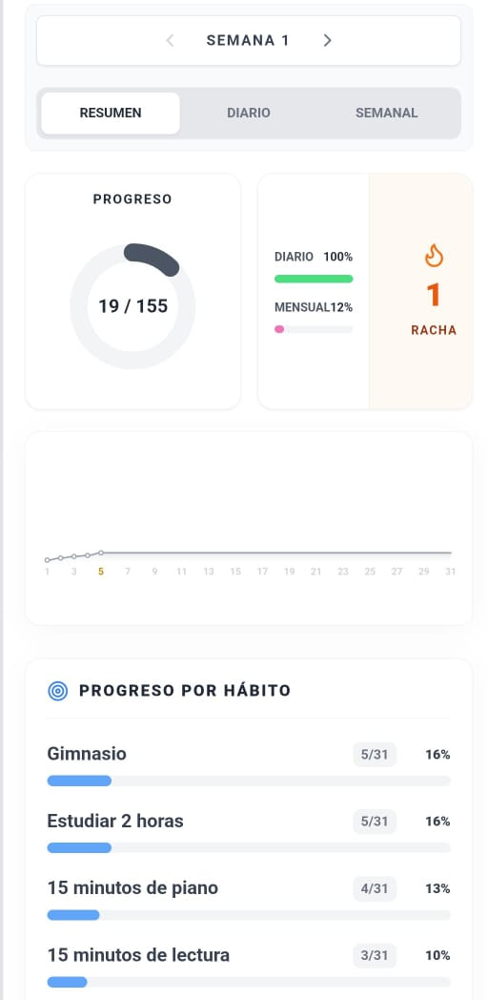
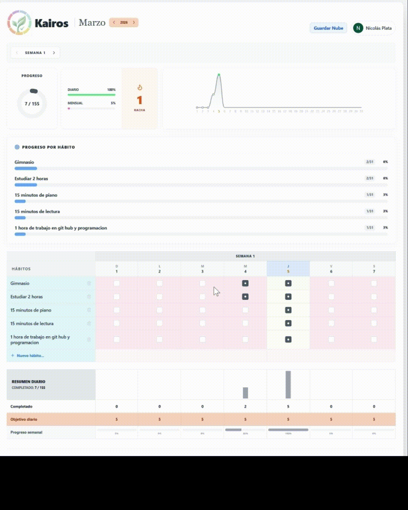

# Kairos - Habit Tracker 🌿


Kairos is a Progressive Web Application (PWA) designed for tracking daily and weekly habits. Built with React and Firebase, it allows users to visually track their progress, keep personal notes, and sync their data in the cloud in real-time across multiple devices.

## 🌐 Live Demo

Try the application here:
**[https://habit-tracker-4ee7f.web.app/](https://habit-tracker-4ee7f.web.app/)**

---

## 📑 Table of Contents
- [Screenshots](#-screenshots)
- [Features](#-main-features)
- [Project Structure](#️-project-structure)
- [Design Decisions](#-design-decisions)
- [Technologies](#️-technologies-used)
- [Installation](#️-local-installation-and-development)
- [Future Improvements](#-future-improvements)
- [License](#-license)

---

## 📸 Screenshots

### Daily Summary & Native Notifications




### Weekly Habit Tracking View


### Mobile View & Responsive Layout


### Interactive Chart & Streak Mechanics


---

## 🚀 Main Features

- **Visual Dashboard**: Dynamically generated SVG progress chart that shows the cumulative trend of habit completion throughout the month without backsliding.
- **Daily and Weekly Tracking**: Record habits you perform every day, as well as general tasks and notes for the week.
- **Cloud Synchronization (Firebase)**: Secure authentication with Google and real-time data saving using Firestore.
- **Native Notifications**: Configurable daily reminders to plan the day using the Web Notifications API.
- **Offline/Local Mode**: If you prefer not to sign in, the application can work entirely locally by saving your habits directly to your browser's storage (`localStorage`).
- **Installable (PWA)**: "Mobile-First" design allowing direct installation of the app on your mobile phone or desktop bypassing traditional app stores.

---

## 🏗️ Project Structure

```text
src/
├── components/          # UI Components
│   ├── AuthScreen.jsx   # Firebase Login Screen
│   ├── HabitTable.jsx   # Main weekly habit tracking matrix
│   └── ProfileDropdown  # User notification and auth settings
├── hooks/
│   └── useHabits.js     # Custom hook abstracting local/cloud logic
├── utils/
│   └── dateUtils.js     # Shared date formatters
├── App.jsx              # Root component and UI Dashboard layout
└── main.jsx             # Entry point and Service Worker (PWA) registration
```

---

## 💡 Design Decisions

- **React Function Components & Hooks:** Utilized to manage states and UI modularly. All complex state management was extracted to the `useHabits` hook to keep the main visual components clean.
- **Firebase BaaS (Backend as a Service):** Firebase was chosen to delegate Google user authentication and enable real-time synchronization without having to write and maintain a custom database or server architecture (GraphQL/REST).
- **Native SVG Charts:** Instead of relying on heavy libraries like Chart.js or Recharts that drastically inflate the application's bundle size, the dashboard charts (progress curves and bars) are drawn dynamically using mathematical statements and React SVG nodes.
- **Tailwind CSS:** Selected to ensure fast "Mobile-First" compatibility without relying on bulky external `.css` stylesheets.

---

## 🛠️ Technologies Used

- **Frontend**: React (Vite)
- **Styling**: Tailwind CSS
- **BaaS**: Firebase (Authentication, Firestore, Hosting)
- **PWA**: `vite-plugin-pwa` for service workers and manifest configuration.
- **Icons**: Lucide React

---

## ⚙️ Local Installation and Development

To run this project locally on your machine, clone the repository and install the dependencies:

```bash
git clone https://github.com/YourUsername/kairos-habit-tracker.git
cd kairos-habit-tracker
npm install
npm run dev
```

*(Note: Requires a `.env` file configured with your own Firebase credentials based on the `.env.example` file).*

---

## 🚧 Future Improvements

- Dynamic dark mode integration.
- Deep habit analytics and statistics (e.g., identifying high-failure days).
- Interactive countdown or Pomodoro timer functionality.
- Advanced accessibility (a11y) options.

---

## 📄 License
This project is licensed under the MIT License.
